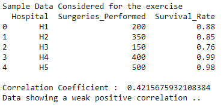
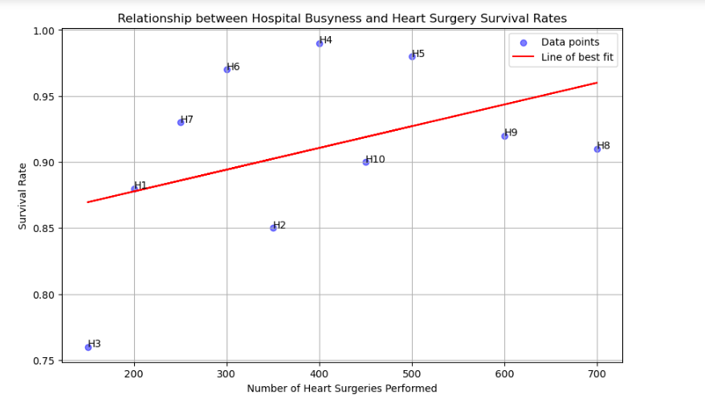

# Project5-STM-Busy-Hospital-Vs-Heart-Survival-Rates
> **Brief Description:** Correlation between number of heart surgeries conducted and survival rate of patients.

---

## Table of Contents

- [Description](#description)
- [Video Explanation](#video)
- [Technologies Used](#technologies-used)
- [Dataset](#dataset)
- [Program Codes ](#program-codes)
- [Screenshots](#screenshots)
- [Contribution](#contributipn)
- [Contact Details](#contact-details)

---

## Description

The program computes the correlation between number of surgeries conducted on heart and the survival rate of the patients there. This indicates that hospitals with greater experience with heart surgeries tend to offer a greater chance of suvival chances to their patients.

## Video
<!--
 
-->

We are working on this section. Please check at some other time.

## Technologies-used

Python programming language, pandas and matplotlib package.

## Dataset

The data set is synthetically generated and used for demonstrating the concept only. The program can be easily modified to show results with real readings taken from the patients.

## Program-codes

The programs are written on jupiter notebook, You may run the program on Google colab by clicking on the colab badge below.

## Screenshots

The program generates and plots a scatter plot to illustrate the relationship between the number of heart surgeries performed and the survival rates in various hospitals. Here's what the plot communicates in layman's terms:

### Plot Overview:
1. **Scatter Plot**:
   - The scatter plot shows data points representing the number of surgeries performed and the corresponding survival rates for different hospitals.
   - It includes a line of best fit to highlight the trend.

### Key Points:
1. **Data Points**:
   - Each blue dot represents a hospital, showing how many heart surgeries were performed and the survival rate at that hospital.
   - Hospital names are labeled next to each dot.

2. **Correlation Coefficient**:
   - The correlation coefficient indicates the strength and direction of the relationship between the number of surgeries performed and the survival rate.
   - In this case, the correlation coefficient suggests a weak positive correlation, meaning that as the number of surgeries performed increases, the survival rate tends to increase slightly, but not strongly.

3. **Line of Best Fit**:
   - The red line represents the general trend in the data, showing the average relationship between the number of surgeries and survival rates.
   - The slope of the line indicates the direction of the relationship.

### Interpretation:
- **Relationship Between Surgeries and Survival Rates**:
  - The scatter plot shows that there is a slight trend where hospitals performing more surgeries tend to have slightly higher survival rates.
  - However, the weak positive correlation means this trend is not very strong, and other factors may also be influencing survival rates.

### In Layman's Terms:
The plot visually explains the relationship between how busy a hospital is with heart surgeries and how well patients tend to survive these surgeries. Each blue dot represents a hospital, showing how many surgeries they perform and their survival rates.

- If a hospital performs more surgeries, they might have a slightly better survival rate, but the connection is not very strong.
- The red line helps to see the overall trend, showing that more surgeries are generally associated with better survival rates, but it's not a significant increase.

This plot helps to understand that while busier hospitals might have slightly better outcomes, other factors are also important for patient survival.

## Contribution

The programs are written by Santanu Karmakar

## Contact-details

If you wish to contact me, please leave a message (Preferably WhatsApp) on this number: 6291 894 897.
Please also mention why you are contacting me. Include your name and necessary details.
Thank you for taking an interest.

